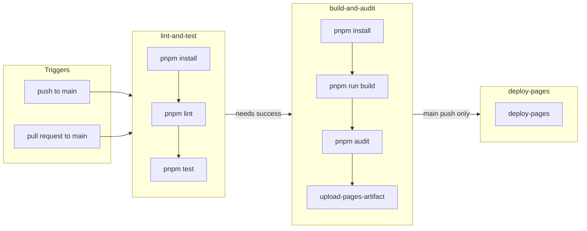

# Rick and Morty Portal

[](https://github.com/VRossi18/rick-morty-portal/actions/workflows/pipeline.yml)

A small **React** app that browses characters from the [Rick and Morty API](https://rickandmortyapi.com/), with a **character detail** view, client-side routing, and a portal-style transition between the grid and the detail screen. This repository doubles as a **hands-on sandbox for learning GitHub Actions**: workflows, jobs, GitHub Pages deploy, and keeping `main` green with automated checks.

---

## Why this project exists

The **primary goal** is to get comfortable with **GitHub Actions** in a real (but small) codebase: defining when workflows run, wiring Node and pnpm, splitting work across jobs, publishing static assets to **GitHub Pages**, and failing fast when lint or tests break. The UI is the fun part; the pipeline is the lesson.

### What the pipeline does

| Job | When | Steps |
| --- | --- | --- |
| **Lint and test** | Every push and PR to `main` | `pnpm install` → `pnpm lint` → `pnpm test` |
| **Build and audit** | After lint and test succeed | `pnpm install` → `pnpm run build` → `pnpm audit` → (on `main` push only) upload `dist` as a Pages artifact |
| **Deploy GitHub Pages** | After build, only on **`push` to `main`** | `actions/deploy-pages` publishes the uploaded artifact |

The production build runs [`scripts/copy-404.mjs`](scripts/copy-404.mjs) after Vite so **`dist/404.html`** mirrors `index.html`. That helps the hosted SPA when users refresh or open a deep link such as `/rick-morty-portal/character/2` on GitHub Pages.



Workflow file: [`.github/workflows/pipeline.yml`](.github/workflows/pipeline.yml). In the repo **Settings → Pages**, the source should be **GitHub Actions** so the deploy job can run.

---

## Tech stack

- **Runtime / tooling:** Node.js **24+**, **pnpm 10** (see `engines` in [`package.json`](package.json))
- **UI:** React 19, TypeScript, Vite 8
- **Routing / motion:** React Router 7, Framer Motion (shared `layoutId` on the character image, `AnimatePresence` between routes)
- **Styling:** Tailwind CSS 4, FlyonUI, `clsx` / `tailwind-merge`
- **Data:** Axios (`GET /character` for lists, `GET /character/:id` for details — see [`CharacterService`](src/services/characters.ts))
- **i18n:** `i18next` + `react-i18next`, copy in [`src/locales/pt/common.json`](src/locales/pt/common.json) / [`src/locales/en/common.json`](src/locales/en/common.json), bootstrap in [`src/i18n.ts`](src/i18n.ts)
- **Quality:** ESLint (flat config), Vitest, Testing Library, jsdom

---

## Current features

- Paginated grid of characters from the public API
- **Filters** — search by name (debounced), status, gender, and optional advanced fields (species, type); wired to [`CharacterService.getCharacters`](src/services/characters.ts)
- **Click a card** (`cursor: pointer`) to open **`/character/:id`**, with a short “portal” feel: other cards dim / ease aside, the image **animates into** the detail layout, and an optional radial overlay uses the click origin when navigation passes `location.state`
- **Character detail** page: full fields from the API (status, species, type, gender, origin, location, episode count, created), loading and error handling (including 404)
- **Back** link to the home grid
- Loading and error states on the list
- **About me** page at **`/about`** (author bio, portrait, contact / social links)
- **Internationalization (PT / EN)** — UI strings live in locale JSON; language is stored in **`localStorage`** (`portal.locale`, default `pt`); **`document.documentElement.lang`** stays in sync; **navbar flag switcher** ([`LanguageSwitcher`](src/components/LanguageSwitcher.tsx))
- Light / dark theme toggle
- Responsive layout
- **Rick and Morty RPG (v1)** — point-buy **character creator** at **`/rpg`**: six races with racial modifiers, 27-point pool, scores 8–15 before racial, live totals; see [`CharacterSheetContainer`](src/components/rpg/CharacterSheetContainer.tsx) and [`useCharacterCreation`](src/components/rpg/useCharacterCreation.ts)
- **`import.meta.env.BASE_URL`** as the router `basename` in production so asset paths and routes stay correct under a GitHub Pages project URL (see [`vite.config.ts`](vite.config.ts))

---

## Roadmap

1. **Rick and Morty tabletop RPG** — extend **`/rpg`** (session tools, episode links, or printed-sheet export) beyond the current point-buy creator

---

## Getting started

**Prerequisites:** Node **24** or newer, **pnpm** 10 (within the range declared in `package.json`).

```bash
git clone https://github.com/VRossi18/rick-morty-portal.git
cd rick-morty-portal
pnpm install
pnpm dev
```

Open the URL Vite prints (usually `http://localhost:5173`). In dev, the app lives at the root path; in production the Vite `base` is set for the GitHub Pages subpath, and the router uses the same value.

### Scripts

| Command | Description |
| --- | --- |
| `pnpm dev` | Start dev server with HMR |
| `pnpm build` | Typecheck, Vite production build, then copy `dist/index.html` → `dist/404.html` for SPA hosting |
| `pnpm preview` | Preview the production build locally |
| `pnpm lint` | Run ESLint on the project |
| `pnpm test` | Run Vitest once (CI mode) |
| `pnpm test:watch` | Run Vitest in watch mode |

These mirror what runs in GitHub Actions so local results should match CI (the `404.html` step runs inside `pnpm build`).
