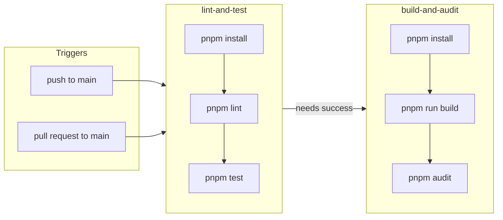

# Rick and Morty Portal

[](https://github.com/VRossi18/rick-morty-portal/actions/workflows/pipeline.yml)

A small **React** app that browses characters from the [Rick and Morty API](https://rickandmortyapi.com/). This repository doubles as a **hands-on sandbox for learning GitHub Actions**: workflows, jobs, caching-friendly installs, and keeping `main` green with automated checks.

---

## Why this project exists

The **primary goal** is to get comfortable with **GitHub Actions** in a real (but small) codebase: defining when workflows run, wiring Node and pnpm, splitting work across jobs, and failing fast when lint or tests break. The UI is the fun part; the pipeline is the lesson.

### What the pipeline does

| Job | When | Steps |
| --- | --- | --- |
| **Lint and test** | Every push and PR to `main` | `pnpm install` → `pnpm lint` → `pnpm test` |
| **Build and audit** | After lint and test succeed | `pnpm install` → `pnpm run build` → `pnpm audit` |



Workflow file: [`.github/workflows/pipeline.yml`](.github/workflows/pipeline.yml).

---

## Tech stack

- **Runtime / tooling:** Node.js **24+**, **pnpm 10** (see `engines` in [`package.json`](package.json))
- **UI:** React 19, TypeScript, Vite 8
- **Styling:** Tailwind CSS 4, FlyonUI, `clsx` / `tailwind-merge`
- **Data:** Axios
- **Quality:** ESLint (flat config), Vitest, Testing Library, jsdom

---

## Current features

- Paginated grid of characters from the public API
- Loading and error states
- Light / dark theme toggle
- Responsive layout

---

## Roadmap

1. **About me** — dedicated page introducing the author / project story  
2. **Character details** — per-character view (deeper than the card summary)  
3. **Search** — filter or find characters via a text input  

---

## Getting started

**Prerequisites:** Node **24** or newer, **pnpm** 10 (within the range declared in `package.json`).

```bash
git clone https://github.com/VRossi18/rick-morty-portal.git
cd rick-morty-portal
pnpm install
pnpm dev
```

Open the URL Vite prints (usually `http://localhost:5173`).

### Scripts

| Command | Description |
| --- | --- |
| `pnpm dev` | Start dev server with HMR |
| `pnpm build` | Typecheck and production build |
| `pnpm preview` | Preview the production build locally |
| `pnpm lint` | Run ESLint on the project |
| `pnpm test` | Run Vitest once (CI mode) |
| `pnpm test:watch` | Run Vitest in watch mode |

These mirror what runs in GitHub Actions so local results should match CI.
